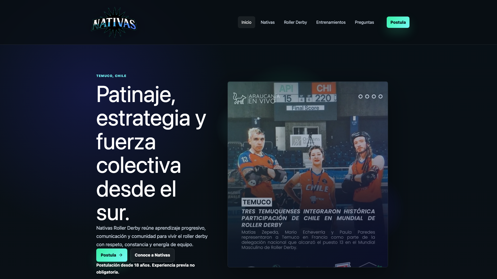

# Nativas Roller Derby Landing Page



Professional static landing page for **Nativas Roller Derby**, a roller derby team from Temuco, Chile. The project is built as a portfolio-quality frontend: strong visual identity, real local media, accessible navigation, an Instagram-style gallery, and a validated application form that can submit to a configurable public form endpoint.

Live site: <https://noisgit.github.io/NativasApp/>

## What This Project Does

- Presents Nativas with a modern, responsive landing page.
- Explains roller derby, track roles, benefits, preparation, training days, FAQ, and the application process.
- Uses a local media repository for brand and photography assets.
- Includes a smooth GSAP motion layer with reduced-motion support.
- Provides an accessible carousel based on local Instagram publication data.
- Includes a complete application form with client-side validation and E.164 phone normalization.
- Deploys as a static frontend on GitHub Pages with `base: /NativasApp/`.

## Stack

- React
- TypeScript
- Vite
- Tailwind CSS
- GSAP + ScrollTrigger
- React Router with HashRouter for GitHub Pages compatibility
- react-phone-number-input + libphonenumber-js
- Vitest + React Testing Library
- Playwright
- GitHub Actions

## Architecture

The project keeps a pragmatic DDD separation:

```text
src/
  domain/          Business rules, entities, validation and URL checks
  application/     Use cases such as form submission and Instagram retrieval
  infrastructure/  Form gateway, public configuration and local content repositories
  presentation/    Pages, layouts, hooks and UI components
  shared/          Site-wide configuration and shared utilities
  assets/          Brand, media and Instagram images
```

The UI does not import backend details directly. The application form depends on a gateway contract, and the current implementation posts to a public endpoint configured through environment variables.

## Static Frontend Scope

This repository intentionally has no database, no authentication, no admin dashboard, and no private backend. All `VITE_*` variables are public at build time and must never contain secrets.

Instagram content is represented by local image files and explicit permalinks in `src/infrastructure/content/instagramPostsRepository.ts`. There is no runtime scraping, no Instagram token, and no private API call from the browser.

## Environment Variables

Copy `.env.example` if you need local configuration:

```env
VITE_APPLICATION_FORM_ENDPOINT=
VITE_PUBLIC_SITE_URL=https://noisgit.github.io/NativasApp/
VITE_FORM_PROVIDER=formspree
```

`VITE_APPLICATION_FORM_ENDPOINT` is a public form-provider URL such as a Formspree or Getform endpoint. The app shows a friendly error if it is missing and never simulates a successful submission.

## Local Development

```bash
npm ci
npm run dev
```

The Vite dev server serves the app with the GitHub Pages base path.

## Scripts

```bash
npm run lint
npm run typecheck
npm run test:run
npm run test:e2e
npm run build
npm audit
```

`npm run validate` runs lint, typecheck, unit tests and build.

## GitHub Pages

The production build uses:

```ts
base: '/NativasApp/'
```

The deploy workflow builds `dist/` and publishes it to GitHub Pages. Configure `VITE_PUBLIC_SITE_URL` as:

```env
https://noisgit.github.io/NativasApp/
```

## Form Flow

The application form asks for:

- full name;
- email;
- international phone number;
- birth date;
- city or comuna;
- optional pronouns;
- prior experience;
- training availability;
- motivation;
- privacy acceptance;
- honeypot and form start timestamp.

Validation lives in `src/domain/application/applicationForm.ts`. The HTTP gateway lives in `src/infrastructure/form/HttpApplicationSubmissionGateway.ts` and applies endpoint checks, timeout handling and abort support.

## Media Management

Central media references live in `src/infrastructure/content/siteMedia.ts`. Replace files there without changing component imports.

Current replaceable files:

- `src/assets/media/nativas-hero.webp`
- `src/assets/media/nativas-about.webp`
- `src/assets/instagram/nativas-bench.webp`
- `src/assets/instagram/nativas-pack.webp`
- `src/assets/instagram/nativas-game-red.webp`
- `src/assets/instagram/nativas-community.webp`
- `src/assets/instagram/nativas-unidas.webp`

Hero image source used in this revision: `WhatsApp Image 2026-06-19 at 22.52.54.jpeg`, optimized into `src/assets/media/nativas-hero.webp`.

## Updating Instagram Cards

1. Save the verified image locally under `src/assets/instagram/`.
2. Optimize it to WebP.
3. Import it in `src/infrastructure/content/siteMedia.ts`.
4. Add or update the object in `src/infrastructure/content/instagramPostsRepository.ts`.
5. Use an official Instagram permalink under `https://www.instagram.com/`.
6. Write concise alt text and a short description.

Do not duplicate photos just to fill the carousel. If there are too few cards to scroll, the carousel automatically hides extra controls and disables autoplay.

## Motion

GSAP is used through React-scoped hooks. Motion includes hero reveal, image scale, subtle parallax, section reveals, card staggers and carousel microinteractions. Reduced motion disables autoplay/parallax-style movement and keeps the content visible.

## Security Notes

- No secrets are stored in frontend code.
- No personal form data is stored in `localStorage`.
- External URLs are validated in domain helpers.
- Instagram links use `target="_blank"` with `rel="noopener noreferrer"`.
- React escapes visible text; captions are not rendered as HTML.
- Form input lengths are limited and normalized before submission.
- The app uses a conservative CSP meta tag compatible with GitHub Pages.

## Accessibility

- Skip link and semantic landmarks.
- Sticky header with keyboard-accessible mobile menu.
- Visible focus states.
- Proper labels, hints and inline errors.
- FAQ buttons use `aria-expanded` and `aria-controls`.
- Carousel controls are keyboard-accessible; cloned slides are hidden from assistive technologies and removed from tab order.
- Reduced-motion behavior is tested.

## Testing

Coverage includes domain validation, form behavior, phone normalization, pronouns, header/footer navigation, carousel behavior, reduced motion, horizontal overflow checks, and README preview dimensions.

Run everything before release:

```bash
npm ci
npm run lint
npm run typecheck
npm run test:run
npm run test:e2e
npm run build
npm audit
```

## Production Checklist

- `VITE_APPLICATION_FORM_ENDPOINT` configured in the deployment environment.
- `VITE_PUBLIC_SITE_URL` set to `https://noisgit.github.io/NativasApp/`.
- Public images optimized and stored locally.
- Instagram permalinks verified.
- No secrets committed.
- All validation commands pass.
